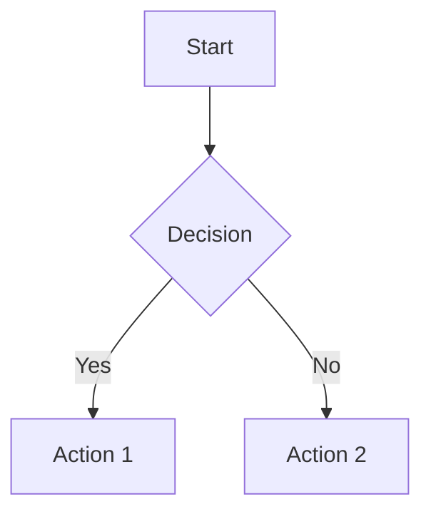

# Micro Markdown Viewer

A lightweight, client-side markdown viewer built with pure HTML, CSS, and JavaScript.

## Features

### 🎯 Core Functionality

- **Dual View Modes**: Switch between webpage and presentation styles
- **Multiple Themes**: Light, Dark, Blue, Green, and Purple themes
- **Local Server Recommended**: Works best with a local HTTP server for full functionality
- **File Parameter Support**: Load any markdown file using URL parameters

### 📝 Markdown Support

- **GitHub Flavored Markdown**: Full GFM support
- **Math Equations**: MathJax integration for LaTeX math rendering
- **Diagrams**: Mermaid integration for flowcharts, sequences, and more
- **Code Highlighting**: Syntax highlighting with highlight.js

### 🔍 Advanced Features

- **Table of Contents**: Auto-generated floating TOC with smooth scrolling
- **Advanced Search**: Real-time search with regex support and context preview
- **Keyboard Navigation**: Full keyboard support for presentations
- **Fullscreen Mode**: Immersive presentation experience
- **Responsive Design**: Works on desktop and mobile devices

## File Structure

```
micromdviewer/
├── index.html      # Main entry point with theme/mode selector
├── page.html       # Webpage-style markdown viewer
├── page.css        # Webpage styling and themes
├── page.js         # Webpage functionality and search
├── slide.html      # Presentation-style markdown viewer
├── slide.css       # Presentation styling and animations
├── slide.js        # Presentation functionality and navigation
├── index.md        # Default markdown document
├── README.md       # This file
└── CLAUDE.md       # Development guide for Claude Code
```

## Getting Started

### Installation

1. **Download**: Clone or download all files to a directory
2. **Set up local server** (recommended for full functionality):
   ```bash
   npm install -g http-server
   ```
3. **Run local server**:
   ```bash
   http-server -c-1 -p 8080
   ```
   Then open `http://localhost:8080` in your browser
4. **Alternative**: Launch `index.html` directly in any modern web browser

### Usage

#### Basic Usage

```
# Open the default document
open index.html

# Load a specific markdown file
open index.html?filename.md

# Load from subdirectory
open index.html?docs/guide.md
```

#### URL Parameters

- `file`: Specify markdown file to load
- `theme`: Set initial theme (light, dark, blue, green, purple)

Example: `index.html?file=docs/guide.md&theme=dark`

## View Modes

### 📄 Webpage Mode

- **Layout**: Traditional document layout with flowing content
- **Navigation**: Floating TOC on the left, search panel on the right
- **Best for**: Documentation, articles, long-form content
- **Features**:
  - Smooth scrolling navigation
  - Advanced search with context preview
  - Print-friendly styling
  - Responsive design

### 🎨 Presentation Mode

- **Layout**: Slide-based presentation with centered content
- **Navigation**: Slide controls and progress bar
- **Best for**: Presentations, tutorials, step-by-step guides
- **Features**:
  - Slide-by-slide navigation
  - Fullscreen support
  - Keyboard shortcuts
  - Slide overview panel

## Keyboard Shortcuts

### Presentation Mode

- `→` / `Space`: Next slide
- `←`: Previous slide
- `Home`: First slide
- `End`: Last slide
- `F` / `F11`: Toggle fullscreen
- `Ctrl+O`: Toggle slide overview
- `Ctrl+F`: Toggle search
- `Escape`: Close panels

### Both Modes

- `Ctrl+F`: Open search
- `Escape`: Close floating panels

## Themes

### Available Themes

- **Light**: Clean white background with dark text
- **Dark**: Dark background with light text
- **Blue**: Blue gradient with professional styling
- **Green**: Green gradient with nature-inspired colors
- **Purple**: Purple gradient with creative styling

### Theme Customization

Themes can be easily customized by modifying the CSS variables in `page.css` and `slide.css`.

## Advanced Features

### Search Functionality

- **Real-time Search**: Results update as you type
- **Context Preview**: See surrounding text for each match
- **Regex Support**: Use regular expressions for complex searches
- **Case Sensitivity**: Toggle case-sensitive matching
- **Navigation**: Click results to jump to location

### Math Support

```markdown
Inline math: $E = mc^2$

Block math:
$$
\int_{-\infty}^{\infty} e^{-x^2} dx = \sqrt{\pi}
$$
```

### Diagram Support

````markdown

````

## Browser Compatibility

- ✅ Chrome/Chromium 80+
- ✅ Firefox 75+
- ✅ Safari 13+
- ✅ Edge 80+

## Development

### Project Structure
The application follows a modular architecture:
- **Entry Point**: `index.html` provides the main interface
- **Viewers**: Separate HTML/CSS/JS for each view mode
- **Shared Libraries**: Common dependencies (marked, highlight.js, MathJax, Mermaid)

### Adding New Themes

1. Add theme class to CSS files
2. Update theme selector in `index.html`
3. Add theme name mapping in JavaScript

### Extending Functionality

- **New View Modes**: Create new HTML/CSS/JS triplet
- **Custom Renderers**: Extend marked.js renderer
- **Additional Libraries**: Add CDN links to HTML files

## Contributing

### Guidelines

- Keep the client-side only architecture
- Maintain browser compatibility
- Follow existing code style
- Test across different browsers and devices

### Common Tasks

- **Bug Reports**: Please include browser version and steps to reproduce
- **Feature Requests**: Consider if the feature fits the lightweight philosophy
- **Pull Requests**: Include documentation updates

## License

This project is open source. Feel free to use, modify, and distribute.

## Troubleshooting

### Common Issues

**Files not loading**

- **Recommended solution**: Use a local server with `http-server`
  ```bash
  npm install -g http-server
  http-server
  ```
- Ensure files are in the same directory as `index.html`
- Check file permissions
- Try different browsers

**Math not rendering**

- Check internet connection (MathJax loads from CDN)
- Verify LaTeX syntax

**Search not working**

- Clear browser cache
- Check console for JavaScript errors

**Themes not applying**

- Refresh the page
- Check browser developer tools for CSS errors

## Credits

Built with these excellent open-source libraries:

- [marked](https://github.com/markedjs/marked) - Markdown parser
- [highlight.js](https://highlightjs.org/) - Syntax highlighting
- [MathJax](https://www.mathjax.org/) - Math rendering
- [Mermaid](https://mermaid.js.org/) - Diagram rendering