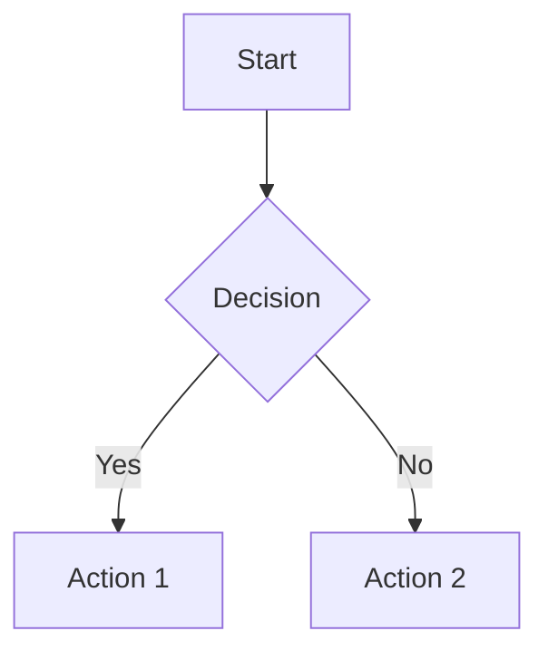

# Mathjax Demo

## Math Support

```markdown
- Inline math: $E = mc^2$
- Block math:

$$
\int_{-\infty}^{\infty} e^{-x^2} dx = \sqrt{\pi}
$$
```

- Inline math: $E = mc^2$
- Block math:

$$
\int_{-\infty}^{\infty} e^{-x^2} dx = \sqrt{\pi}
$$

## Diagram Support

````markdown

````


